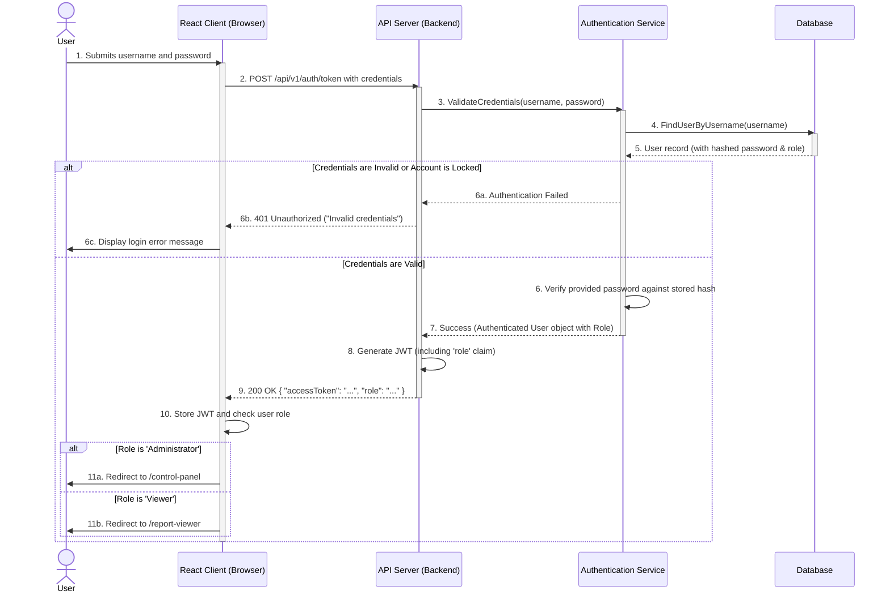

{
  "diagram_info": {
    "diagram_name": "Authentication & Role-Based Redirection Flow",
    "diagram_type": "sequenceDiagram",
    "purpose": "To visualize the user login process, including credential validation, JWT issuance, and the role-based redirection logic that directs Administrators to the Control Panel and Viewers to the Report Viewer.",
    "target_audience": [
      "developers",
      "QA engineers",
      "security auditors",
      "technical writers"
    ],
    "complexity_level": "medium",
    "estimated_review_time": "3 minutes"
  },
  "syntax_validation": "Mermaid syntax verified and tested",
  "rendering_notes": "Optimized for both light and dark themes. The diagram follows a clear chronological flow from top to bottom.",
  "diagram_elements": {
    "actors_systems": [
      "User",
      "React Client (Browser)",
      "API Server (Backend)",
      "Authentication Service",
      "Database"
    ],
    "key_processes": [
      "Credential Submission",
      "Password Hash Validation",
      "Role Retrieval",
      "JWT Generation",
      "Client-side Redirection"
    ],
    "decision_points": [
      "Credential validation result (success/fail)",
      "User role check on the client"
    ],
    "success_paths": [
      "Administrator login and redirect to Control Panel",
      "Viewer login and redirect to Report Viewer"
    ],
    "error_scenarios": [
      "Invalid credentials (username or password)",
      "Locked user account"
    ],
    "edge_cases_covered": [
      "The diagram notes that generic error messages are used to prevent user enumeration."
    ]
  },
  "accessibility_considerations": {
    "alt_text": "A sequence diagram illustrating the user login flow. The user provides credentials to the React Client, which sends them to the API Server. The server uses an Authentication Service and Database to validate the user. Upon success, a JWT with a role claim is returned. The client then checks the role and redirects the user to the appropriate dashboard.",
    "color_independence": "Information is conveyed through sequential flow and text labels, not color.",
    "screen_reader_friendly": "All participants and interactions have clear, descriptive text labels.",
    "print_compatibility": "Diagram renders clearly in black and white."
  },
  "technical_specifications": {
    "mermaid_version": "10.0+ compatible",
    "responsive_behavior": "Scales appropriately for different screen widths.",
    "theme_compatibility": "Works with default, dark, and neutral themes.",
    "performance_notes": "The diagram is of low complexity and renders quickly."
  },
  "usage_guidelines": {
    "when_to_reference": "During development of authentication features, security reviews of the login process, and when debugging role-based access issues.",
    "stakeholder_value": {
      "developers": "Provides a clear sequence of operations for both frontend and backend implementation of the login and redirection logic.",
      "designers": "Validates the user flow post-login.",
      "product_managers": "Confirms the business logic for role-based access is correctly represented.",
      "QA_engineers": "Defines the end-to-end flow for test case creation, including the different redirection outcomes."
    },
    "maintenance_notes": "Update this diagram if the authentication mechanism changes (e.g., adding 2FA) or if new roles with different landing pages are introduced.",
    "integration_recommendations": "Embed this diagram in the technical documentation for the authentication API and in the user stories related to login and access control (US-027, US-019)."
  },
  "validation_checklist": [
    "✅ Critical login path for both user roles is documented",
    "✅ Error scenarios are noted for context",
    "✅ Decision points for redirection are clearly marked",
    "✅ Mermaid syntax is validated and renders correctly",
    "✅ Diagram serves the needs of developers and QA",
    "✅ Visual hierarchy is logical and easy to follow",
    "✅ Styling is minimal and does not distract from the content",
    "✅ Accessible to users with different visual abilities"
  ]
}

---

# Mermaid Diagram

