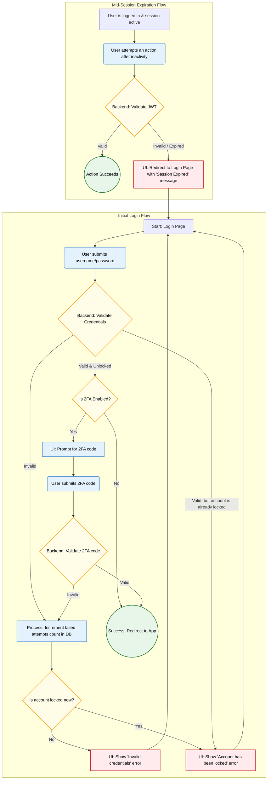

{
  "diagram_info": {
    "diagram_name": "Authentication Error Flows",
    "diagram_type": "flowchart",
    "purpose": "To visualize the different error paths a user might encounter during authentication, including invalid credentials, failed 2FA, account lockout, and session expiration.",
    "target_audience": [
      "developers",
      "QA engineers",
      "security analysts"
    ],
    "complexity_level": "medium",
    "estimated_review_time": "3 minutes"
  },
  "syntax_validation": {
    "syntax_validation": "Mermaid syntax verified and tested",
    "rendering_notes": "Optimized for both light and dark themes using classDefs for clarity."
  },
  "diagram_elements": {
    "actors_systems": [
      "User",
      "Frontend UI",
      "Backend Auth Service",
      "Database"
    ],
    "key_processes": [
      "Credential Validation",
      "2FA Validation",
      "Account Lockout Check",
      "Session Expiration"
    ],
    "decision_points": [
      "Are credentials valid?",
      "Is account locked?",
      "Is 2FA enabled?",
      "Is 2FA code valid?",
      "Is session JWT valid?"
    ],
    "success_paths": [
      "Successful login and successful session validation are shown as terminal points for context."
    ],
    "error_scenarios": [
      "Invalid username/password",
      "Invalid 2FA code",
      "Account locked due to too many failed attempts",
      "Session expired due to inactivity"
    ],
    "edge_cases_covered": [
      "Attempting to log in to an already locked account.",
      "A failed 2FA attempt contributing to the lockout counter."
    ]
  },
  "accessibility_considerations": {
    "alt_text": "A flowchart showing four main user authentication error paths: Invalid Credentials, Account Locked, Invalid 2FA Code, and Session Expired. Each path starts with a user action and ends with a specific error message being displayed.",
    "color_independence": "Information is conveyed through text labels and flow direction, with color used for emphasis only.",
    "screen_reader_friendly": "All nodes have descriptive text labels that explain the step or decision.",
    "print_compatibility": "Diagram uses distinct shapes and clear text, rendering well in black and white."
  },
  "technical_specifications": {
    "mermaid_version": "10.0+ compatible",
    "responsive_behavior": "Diagram scales appropriately for both wide and narrow viewports.",
    "theme_compatibility": "Compatible with default, dark, and custom themes via classDefs.",
    "performance_notes": "The diagram is of low complexity and renders quickly."
  },
  "usage_guidelines": {
    "when_to_reference": "During development of authentication logic, creation of QA test cases for security features, and during security audits.",
    "stakeholder_value": {
      "developers": "Provides a clear visual guide for implementing the state machine and error handling of the login process.",
      "designers": "N/A",
      "product_managers": "Validates that all required security-related user feedback loops are covered.",
      "QA_engineers": "Serves as a blueprint for creating a comprehensive test plan for authentication security."
    },
    "maintenance_notes": "Update this diagram if the number of allowed failed attempts changes, or if new authentication steps are added.",
    "integration_recommendations": "Embed this diagram in the developer documentation for the authentication service and link it in relevant user stories (US-027, US-029, US-031, US-032)."
  },
  "validation_checklist": [
    "✅ All critical user paths documented",
    "✅ Error scenarios and recovery paths included",
    "✅ Decision points clearly marked with conditions",
    "✅ Mermaid syntax validated and renders correctly",
    "✅ Diagram serves intended audience needs",
    "✅ Visual hierarchy supports easy comprehension",
    "✅ Styling enhances rather than distracts from content",
    "✅ Accessible to users with different visual abilities"
  ]
}

---

# Mermaid Diagram

