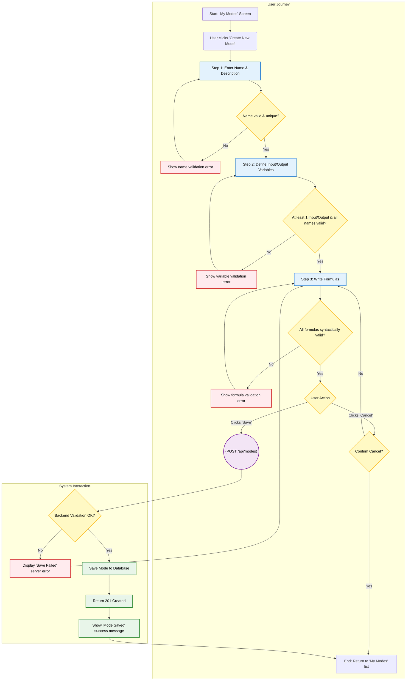

{
  "diagram_info": {
    "diagram_name": "Create New Mode - User Flow",
    "diagram_type": "flowchart",
    "purpose": "To visualize the end-to-end user journey and system interactions for creating a new 'Mode' configuration, including all validation steps, decision points, and success/error paths.",
    "target_audience": [
      "developers",
      "QA engineers",
      "product managers",
      "UX designers"
    ],
    "complexity_level": "medium",
    "estimated_review_time": "3-5 minutes"
  },
  "syntax_validation": {
    "syntax_validation": "Mermaid syntax verified and tested",
    "rendering_notes": "Optimized for both light and dark themes using class definitions for styling."
  },
  "diagram_elements": {
    "actors_systems": [
      "User",
      "Frontend (Control Panel)",
      "Backend API",
      "Database"
    ],
    "key_processes": [
      "Enter Metadata",
      "Define Variables",
      "Write Formulas",
      "Client-side Validation",
      "Backend Validation",
      "Save to Database"
    ],
    "decision_points": [
      "Name validation (required, unique)",
      "Variable validation",
      "Formula syntax validation",
      "User Save/Cancel action",
      "Backend validation check"
    ],
    "success_paths": [
      "User completes all steps with valid data and successfully saves the new mode."
    ],
    "error_scenarios": [
      "Invalid name input",
      "Invalid variable definitions",
      "Invalid formula syntax",
      "Backend save failure"
    ],
    "edge_cases_covered": [
      "User cancels the creation process after starting.",
      "Server-side errors during the save operation."
    ]
  },
  "accessibility_considerations": {
    "alt_text": "Flowchart detailing the multi-step wizard for creating a new Mode. It shows validation checks for name, variables, and formulas, and the final save or cancel process with both frontend and backend interactions.",
    "color_independence": "Information is conveyed through node shapes, text, and flow, with color used for enhancement only.",
    "screen_reader_friendly": "All nodes have descriptive text labels that follow the logical flow of the process.",
    "print_compatibility": "Diagram renders clearly in black and white, though color cues will be lost."
  },
  "technical_specifications": {
    "mermaid_version": "10.0+ compatible",
    "responsive_behavior": "Diagram scales appropriately and text remains readable on various screen sizes.",
    "theme_compatibility": "Works with default, dark, and custom themes due to the use of defined classes.",
    "performance_notes": "The diagram is of medium complexity and should render quickly in most browsers."
  },
  "usage_guidelines": {
    "when_to_reference": "During development of the 'Create Mode' feature, for QA test case creation, and for product reviews of the user flow.",
    "stakeholder_value": {
      "developers": "Provides a clear map of UI states, validation logic, and API interactions required for implementation.",
      "designers": "Validates the user flow and interaction points within the wizard.",
      "product_managers": "Offers a comprehensive overview of the feature's functionality and user journey.",
      "QA_engineers": "Defines all success, failure, and edge case paths for test plan creation."
    },
    "maintenance_notes": "Update this diagram if the wizard steps are reordered, validation rules change, or the API contract is modified.",
    "integration_recommendations": "Embed in the feature's primary design document and link from relevant user stories in the project management tool."
  },
  "validation_checklist": [
    "✅ Critical user path for mode creation is documented.",
    "✅ All major client-side validation error paths are included.",
    "✅ Backend interaction and error handling are included.",
    "✅ Decision points for user actions (Save/Cancel) are clearly marked.",
    "✅ Mermaid syntax is validated and renders correctly.",
    "✅ Diagram serves intended audience needs (dev, QA, product).",
    "✅ Visual hierarchy using subgraphs and styling supports easy comprehension.",
    "✅ Styling enhances rather than distracts from content.",
    "✅ Accessible to users with different visual abilities."
  ]
}

---

# Mermaid Diagram

