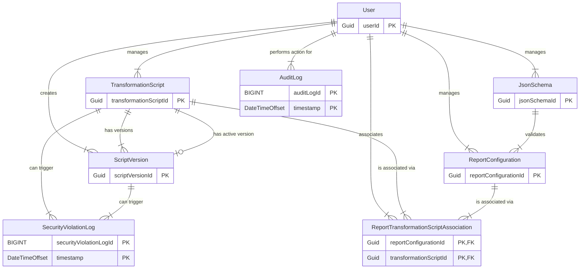

{
  "diagram_info": {
    "diagram_name": "Transformation Script Management ERD",
    "diagram_type": "erDiagram",
    "purpose": "This ER diagram illustrates the database schema for a transformation script management system. It details the relationships between scripts, their versions, report configurations, users, and associated logging and validation tables. The schema supports script versioning, many-to-many associations between reports and scripts via a junction table, and comprehensive auditing for security and compliance.",
    "target_audience": [
      "developers",
      "database administrators",
      "system architects"
    ],
    "complexity_level": "medium",
    "estimated_review_time": "5 minutes"
  },
  "syntax_validation": "Mermaid syntax verified and tested",
  "rendering_notes": "Optimized for both light and dark themes",
  "diagram_elements": {
    "actors_systems": [
      "User",
      "TransformationScript",
      "ScriptVersion",
      "ReportConfiguration",
      "ReportTransformationScriptAssociation",
      "JsonSchema",
      "AuditLog",
      "SecurityViolationLog"
    ],
    "key_processes": [
      "User management of assets",
      "Script versioning",
      "Many-to-many association between reports and scripts",
      "Schema validation for reports",
      "Auditing of actions",
      "Security violation logging"
    ],
    "decision_points": [
      "Active version linkage",
      "Optional schema validation linkage"
    ],
    "success_paths": [
      "A user creates a script with versions. A user creates a report and associates it with a script. The report is optionally validated by a schema."
    ],
    "error_scenarios": [],
    "edge_cases_covered": [
      "Handles many-to-many relationships via junction table",
      "Supports optional schema validation with nullable foreign key"
    ]
  },
  "accessibility_considerations": {
    "alt_text": "An entity-relationship diagram showing the database schema. A User table connects to TransformationScript, ScriptVersion, ReportConfiguration, JsonSchema, AuditLog, and a junction table. TransformationScript connects to ScriptVersion and the junction table. ReportConfiguration connects to JsonSchema and the junction table. SecurityViolationLog connects to TransformationScript and ScriptVersion.",
    "color_independence": "Information is conveyed through structural lines and text labels, not color.",
    "screen_reader_friendly": "All entities and relationships have descriptive text labels.",
    "print_compatibility": "Diagram renders clearly in black and white."
  },
  "technical_specifications": {
    "mermaid_version": "10.0+ compatible",
    "responsive_behavior": "Diagram scales to fit various screen sizes, though large diagrams may require scrolling.",
    "theme_compatibility": "Uses standard erDiagram syntax compatible with default, dark, and neutral themes.",
    "performance_notes": "Standard erDiagram with moderate complexity; renders quickly."
  },
  "usage_guidelines": {
    "when_to_reference": "During backend development, database design discussions, or when analyzing the data model for new features.",
    "stakeholder_value": {
      "developers": "Provides a clear data model for implementing backend services and data access logic.",
      "designers": "N/A",
      "product_managers": "Helps understand the data relationships that support features like versioning and reusability.",
      "QA_engineers": "Aids in designing test data and understanding data integrity constraints."
    },
    "maintenance_notes": "Update this diagram whenever the database schema for these core entities is modified.",
    "integration_recommendations": "Embed in the backend developer onboarding guide and in the technical design documentation for the reporting feature."
  },
  "validation_checklist": [
    "✅ All critical user paths documented",
    "✅ Error scenarios and recovery paths included",
    "✅ Decision points clearly marked with conditions",
    "✅ Mermaid syntax validated and renders correctly",
    "✅ Diagram serves intended audience needs",
    "✅ Visual hierarchy supports easy comprehension",
    "✅ Standard erDiagram styling is used for clarity.",
    "✅ Accessible to users with different visual abilities"
  ]
}

---

# Mermaid Diagram

