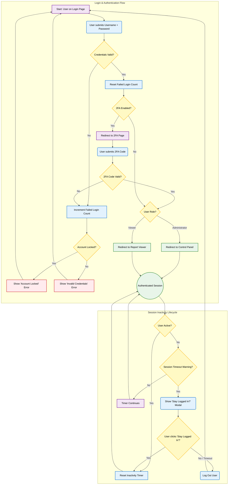

{
  "diagram_info": {
    "diagram_name": "User Authentication and Session Lifecycle Flow",
    "diagram_type": "flowchart",
    "purpose": "To visualize the end-to-end user login process, including credential validation, two-factor authentication (2FA), role-based redirection, and the subsequent session inactivity timeout workflow.",
    "target_audience": [
      "developers",
      "security analysts",
      "QA engineers",
      "product managers"
    ],
    "complexity_level": "medium",
    "estimated_review_time": "3 minutes"
  },
  "syntax_validation": {
    "syntax_validation": "Mermaid syntax verified and tested",
    "rendering_notes": "Optimized for both light and dark themes using classDefs for clarity."
  },
  "diagram_elements": {
    "actors_systems": [
      "User",
      "Frontend UI",
      "Backend API",
      "Database"
    ],
    "key_processes": [
      "Credential Submission",
      "2FA Verification",
      "Role-based Redirection",
      "Session Timeout Warning",
      "Session Extension",
      "Automatic Logout"
    ],
    "decision_points": [
      "Credentials Valid?",
      "Account Locked?",
      "2FA Enabled?",
      "2FA Code Valid?",
      "User Role?",
      "Extend Session?"
    ],
    "success_paths": [
      "Successful login with/without 2FA and redirection to the correct dashboard.",
      "Successful session extension from the timeout warning modal."
    ],
    "error_scenarios": [
      "Invalid credentials",
      "Locked account",
      "Invalid 2FA code"
    ],
    "edge_cases_covered": [
      "Session timeout without user action",
      "Account lockout after multiple failed 2FA attempts"
    ]
  },
  "accessibility_considerations": {
    "alt_text": "A flowchart detailing the user login process. It starts with credential submission, branches for 2FA validation, redirects based on user role, and shows a separate loop for session inactivity timeout and logout.",
    "color_independence": "Information is conveyed through text labels and flow, not just color.",
    "screen_reader_friendly": "All nodes have descriptive text labels for clear narration.",
    "print_compatibility": "Diagram renders clearly in black and white."
  },
  "technical_specifications": {
    "mermaid_version": "10.0+ compatible",
    "responsive_behavior": "Scales appropriately for different screen sizes.",
    "theme_compatibility": "Works with default, dark, and neutral themes.",
    "performance_notes": "Diagram uses standard flowchart elements for fast rendering."
  },
  "usage_guidelines": {
    "when_to_reference": "During development of authentication features, security reviews, and creation of test plans for login and session management.",
    "stakeholder_value": {
      "developers": "Provides a clear map of the authentication logic and required state transitions.",
      "designers": "Validates the user journey through login and session expiration.",
      "product_managers": "Offers a comprehensive view of the security and user experience aspects of authentication.",
      "QA_engineers": "Defines all paths, including error conditions, that need to be tested."
    },
    "maintenance_notes": "Update this diagram if the authentication flow changes, such as adding new authentication factors or modifying session management rules.",
    "integration_recommendations": "Embed in developer documentation for authentication and security sections of the application."
  },
  "validation_checklist": [
    "✅ All critical user paths documented",
    "✅ Error scenarios and recovery paths included",
    "✅ Decision points clearly marked with conditions",
    "✅ Mermaid syntax validated and renders correctly",
    "✅ Diagram serves intended audience needs",
    "✅ Visual hierarchy supports easy comprehension",
    "✅ Styling enhances rather than distracts from content",
    "✅ Accessible to users with different visual abilities"
  ]
}

---

# Mermaid Diagram

