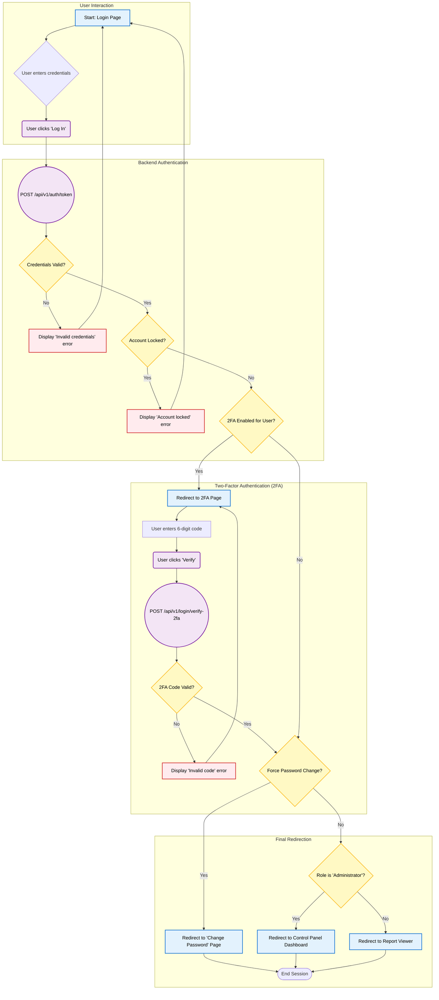

{
  "diagram_info": {
    "diagram_name": "User Login Flow",
    "diagram_type": "flowchart",
    "purpose": "Clearly maps the user's journey from entering credentials on the login page to landing on their role-specific dashboard, including paths for Two-Factor Authentication (2FA), forced password change, and common authentication errors.",
    "target_audience": [
      "developers",
      "QA engineers",
      "product managers",
      "security analysts"
    ],
    "complexity_level": "medium",
    "estimated_review_time": "2 minutes"
  },
  "syntax_validation": "Mermaid syntax verified and tested",
  "rendering_notes": "Optimized for both light and dark themes using class definitions.",
  "diagram_elements": {
    "actors_systems": [
      "User",
      "Frontend Application (UI)",
      "Backend Authentication API"
    ],
    "key_processes": [
      "Credential Submission",
      "Backend Validation",
      "2FA Verification",
      "Forced Password Change Check",
      "Role-Based Redirection"
    ],
    "decision_points": [
      "Are credentials valid?",
      "Is the account locked?",
      "Is 2FA enabled?",
      "Is the 2FA code valid?",
      "Is a password change required?",
      "What is the user's role?"
    ],
    "success_paths": [
      "Successful login for an Administrator to the Control Panel.",
      "Successful login for a Viewer to the Report Viewer.",
      "Successful login with 2FA enabled."
    ],
    "error_scenarios": [
      "Invalid username or password.",
      "Attempting to log into a locked account.",
      "Submitting an invalid 2FA code."
    ],
    "edge_cases_covered": [
      "User is forced to change their password on first login after a reset."
    ]
  },
  "accessibility_considerations": {
    "alt_text": "A flowchart detailing the user login process. It shows the steps from entering credentials, through validation, optional 2FA, and finally redirecting to the correct dashboard based on user role. It also includes error paths for invalid credentials and locked accounts.",
    "color_independence": "Information is primarily conveyed through text and flow, with color used as a secondary enhancement.",
    "screen_reader_friendly": "All nodes have descriptive text labels.",
    "print_compatibility": "Diagram renders clearly in black and white."
  },
  "technical_specifications": {
    "mermaid_version": "10.0+ compatible",
    "responsive_behavior": "Scales appropriately for different screen sizes.",
    "theme_compatibility": "Works with default, dark, and neutral themes.",
    "performance_notes": "The diagram is of medium complexity and should render quickly."
  },
  "usage_guidelines": {
    "when_to_reference": "During development or review of authentication features, onboarding flows, and security policies.",
    "stakeholder_value": {
      "developers": "Provides a clear sequence of API calls and logic for the authentication workflow.",
      "designers": "Validates the user flow for login, including all necessary steps and error states.",
      "product_managers": "Offers a concise visual summary of the complete login experience for all user types and states.",
      "QA_engineers": "Defines the test cases for all login paths, including success, failure, and edge cases."
    },
    "maintenance_notes": "Update this diagram if new authentication factors are added or if the role-based redirection logic changes.",
    "integration_recommendations": "Embed in the technical documentation for the authentication service and within relevant user stories (US-027, US-029, US-030, US-031)."
  },
  "validation_checklist": [
    "✅ All critical user paths documented",
    "✅ Error scenarios and recovery paths included",
    "✅ Decision points clearly marked with conditions",
    "✅ Mermaid syntax validated and renders correctly",
    "✅ Diagram serves intended audience needs",
    "✅ Visual hierarchy supports easy comprehension",
    "✅ Styling enhances rather than distracts from content",
    "✅ Accessible to users with different visual abilities"
  ]
}

---

# Mermaid Diagram

