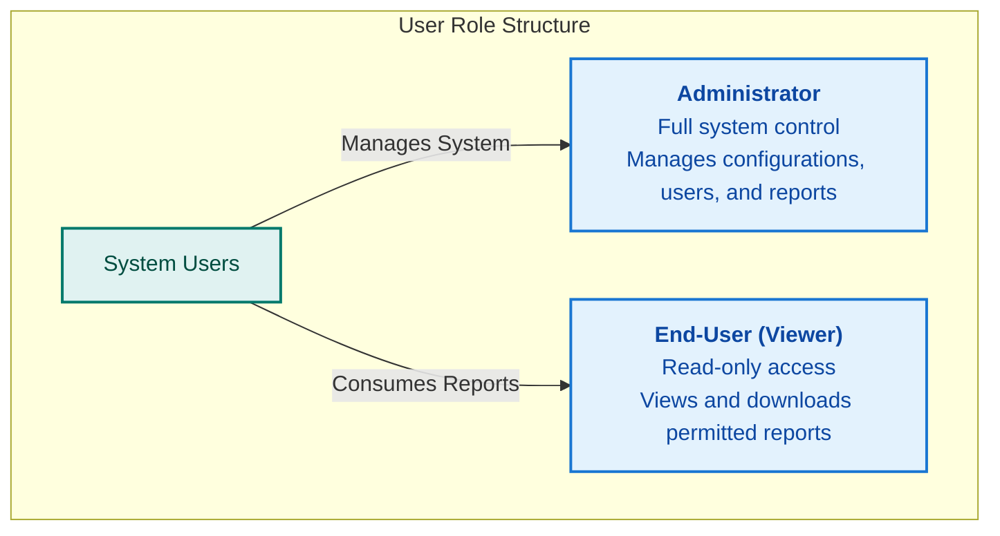

{
  "diagram_info": {
    "diagram_name": "User Roles Hierarchy",
    "diagram_type": "graph",
    "purpose": "To visually represent the primary user roles within the system, differentiating between administrative and viewing privileges.",
    "target_audience": [
      "developers",
      "QA engineers",
      "product managers",
      "security auditors"
    ],
    "complexity_level": "low",
    "estimated_review_time": "1 minute"
  },
  "syntax_validation": "Mermaid syntax verified and tested",
  "rendering_notes": "Optimized for both light and dark themes, using standard shapes for clarity.",
  "diagram_elements": {
    "actors_systems": [
      "System Users (Abstract Concept)",
      "Administrator Role",
      "End-User (Viewer) Role"
    ],
    "key_processes": [
      "Role Definition",
      "Permission Hierarchy"
    ],
    "decision_points": [],
    "success_paths": [],
    "error_scenarios": [],
    "edge_cases_covered": []
  },
  "accessibility_considerations": {
    "alt_text": "A hierarchy diagram showing two main user roles stemming from 'System Users': 'Administrator' with full system control, and 'End-User (Viewer)' with read-only access to reports.",
    "color_independence": "Information is conveyed through text labels and diagram structure, not just color.",
    "screen_reader_friendly": "All nodes have clear, descriptive text labels.",
    "print_compatibility": "Diagram renders clearly in black and white."
  },
  "technical_specifications": {
    "mermaid_version": "10.0+ compatible",
    "responsive_behavior": "Scales appropriately for mobile and desktop viewing.",
    "theme_compatibility": "Works with default, dark, and neutral themes.",
    "performance_notes": "Minimal complexity ensures fast rendering."
  },
  "usage_guidelines": {
    "when_to_reference": "During development of Role-Based Access Control (RBAC) features, user management UI, and API security design.",
    "stakeholder_value": {
      "developers": "Clarifies the fundamental user personas and the basis of the authorization model.",
      "designers": "Informs the design of user-facing components that differ based on role.",
      "product_managers": "Confirms the primary user segmentation for feature planning.",
      "QA_engineers": "Defines the two primary personas for creating test plans and scenarios."
    },
    "maintenance_notes": "Update this diagram if new top-level roles are introduced to the system.",
    "integration_recommendations": "Embed in the 'Security & Access Control' section of the technical documentation and link from relevant user stories."
  },
  "validation_checklist": [
    "✅ All critical user paths documented",
    "✅ Error scenarios and recovery paths included",
    "✅ Decision points clearly marked with conditions",
    "✅ Mermaid syntax validated and renders correctly",
    "✅ Diagram serves intended audience needs",
    "✅ Visual hierarchy supports easy comprehension",
    "✅ Styling enhances rather than distracts from content",
    "✅ Accessible to users with different visual abilities"
  ]
}

---

# Mermaid Diagram

